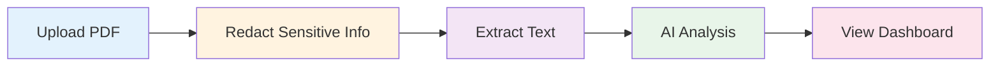

# 🏦 Bank Statement Analyzer

<div align="center">


**A privacy-first, AI-powered bank statement analyzer that intelligently extracts and categorizes transactions from PDF statements.**

[Features](#-features) • [Demo](#-demo) • [Installation](#-installation) • [Usage](#-usage) • [API Providers](#-supported-ai-providers) • [Privacy](#-privacy--security)

</div>

---

## ✨ Features

### 🤖 AI-Powered Analysis
- **Multi-Provider Support**: Choose from OpenAI, Anthropic, Gemini, or Groq
- **Intelligent Categorization**: Automatically categorizes transactions into 10+ categories
- **Smart Extraction**: Accurately extracts dates, amounts, descriptions, and transaction types
- **12+ AI Models**: Select the perfect model for your needs and budget

### 🔒 Privacy-First Design
- **Local Processing**: PDF redaction happens entirely in your browser
- **No Server Storage**: Your data never touches our servers
- **Redaction Protection**: Redacted information is NEVER sent to AI providers
- **Your API Key**: Use your own API key stored securely in your browser

### 🎨 Beautiful UI/UX
- **Modern Design**: Clean, intuitive interface with smooth animations
- **Dark Mode Support**: Easy on the eyes, day or night
- **Responsive**: Works seamlessly on desktop and mobile
- **Real-time Feedback**: Visual indicators for every action

### 📊 Comprehensive Analytics
- **Transaction Dashboard**: View all transactions with filtering and sorting
- **Category Breakdown**: Pie charts showing spending by category
- **Income vs Expenses**: Track your financial health at a glance
- **Export Options**: Download your analyzed data

---

## 🎯 How It Works



1. **Upload** your bank statement PDF
2. **Redact** sensitive information (names, account numbers, etc.)
3. **Extract** text from the PDF (excluding redacted areas)
4. **Analyze** with AI to categorize and summarize transactions
5. **View** your financial insights on a beautiful dashboard

---

## 🚀 Installation

### Prerequisites
- Node.js 18+ and npm
- An API key from one of the supported providers

### Quick Start

```bash
# Clone the repository
git clone https://github.com/sharon1999/BankStatementAnalyser.git
cd BankStatementAnalyser

# Install dependencies
npm install

# Start the development server
npm run dev
```

The app will be available at `http://localhost:5173`

### Build for Production

```bash
npm run build
npm run preview
```

---

## 📖 Usage

### 1️⃣ Configure AI Settings

Click the **Settings** icon (⚙️) in the navbar and:

1. Select your preferred **AI Provider**
2. Choose a **Model** (see cost estimates)
3. Enter your **API Key**
4. Click **Test Connection** to verify
5. **Save Settings**

### 2️⃣ Analyze a Statement

1. **Upload** your bank statement PDF
2. **Redact** any sensitive information by drawing boxes
3. **Review** the extracted text
4. **Confirm** to start AI analysis
5. **Explore** your financial dashboard!

---

## 🤖 Supported AI Providers

### OpenAI
| Model | Best For | Cost per Analysis* |
|-------|----------|-------------------|
| GPT-4o | Highest accuracy | ~$0.027 |
| **GPT-4o Mini** ⭐ | Best value | ~$0.001 |
| GPT-3.5 Turbo | Speed | ~$0.002 |

### Anthropic (Claude)
| Model | Best For | Cost per Analysis* |
|-------|----------|-------------------|
| Claude 3.5 Sonnet | Best overall | ~$0.021 |
| Claude 3 Opus | Most capable | ~$0.067 |
| Claude 3 Haiku | Fastest | ~$0.002 |

### Google Gemini
| Model | Best For | Cost per Analysis* |
|-------|----------|-------------------|
| Gemini 2.5 Pro | Best quality | ~$0.008 |
| **Gemini 2.5 Flash** ⭐ | Fast & affordable | ~$0.0005 |
| Gemini 2.0 Flash | Alternative | ~$0.0005 |

### Groq
| Model | Best For | Cost per Analysis* |
|-------|----------|-------------------|
| **Llama 3.1 70B** ⭐ | FREE & Fast | **$0.00** |
| Mixtral 8x7B | FREE & Fast | **$0.00** |
| Gemma 7B | FREE & Fastest | **$0.00** |

<sub>*Based on ~3,000 input + ~800 output tokens per typical bank statement</sub>

### 🎁 Recommended Providers

- **Free**: Groq (Llama 3.1 70B) - No cost, very fast
- **Paid**: OpenAI (GPT-4o Mini) - Best balance of quality and cost

---

## 🔐 Privacy & Security

### What's Protected
✅ **Redacted text is NEVER sent to AI providers**  
✅ **Your API key stays in your browser** (encrypted in localStorage)  
✅ **No data stored on our servers**  
✅ **All PDF processing happens locally**  

### What's Sent to AI
Only the **non-redacted text** from your bank statement is sent to your chosen AI provider for analysis.

### Data Flow
```
PDF Upload → Local Redaction → Text Extraction
                                      ↓
                    ┌─────────────────┴─────────────────┐
                    ↓                                   ↓
            Redacted Text                      Non-Redacted Text
         (UI Display Only)                    (Sent to AI API)
         ❌ NEVER sent                        ✅ Analyzed by AI
```

---

## 🛠️ Tech Stack

### Frontend
- **React 18.3** - UI framework
- **TypeScript 5.6** - Type safety
- **Vite 7.1** - Build tool
- **Tailwind CSS 3.4** - Styling
- **Framer Motion 11.15** - Animations

### PDF Processing
- **PDF.js** - PDF parsing and rendering
- **Canvas API** - PDF redaction

### AI Integration
- **Native Fetch API** - No additional dependencies
- **Multi-provider support** - OpenAI, Anthropic, Gemini, Groq

### State Management
- **React Hooks** - useState, useEffect
- **localStorage** - Settings persistence

---

## 📁 Project Structure

```
BankStatementAnalyser/
├── src/
│   ├── components/          # React components
│   │   ├── Dashboard.tsx
│   │   ├── FileUploader.tsx
│   │   ├── LoadingScreen.tsx
│   │   ├── Navbar.tsx
│   │   ├── PDFRedactor.tsx
│   │   ├── PreviewPage.tsx
│   │   └── SettingsModal.tsx
│   ├── services/            # Business logic
│   │   └── llmService.ts    # AI provider integrations
│   ├── types/               # TypeScript types
│   │   ├── llm.ts
│   │   └── transaction.ts
│   ├── utils/               # Utility functions
│   │   ├── pdfProcessor.ts
│   │   └── settingsStorage.ts
│   ├── App.tsx              # Main app component
│   └── main.tsx             # Entry point
├── public/                  # Static assets
├── package.json
└── README.md
```

---

## 🎨 Screenshots

### Upload & Redact
*Upload your PDF and redact sensitive information with an intuitive drawing interface*

### AI Settings
*Configure your preferred AI provider with cost estimates and connection testing*

### Dashboard
*View comprehensive analytics with beautiful charts and transaction lists*

---

## 🤝 Contributing

Contributions are welcome! Please feel free to submit a Pull Request.

1. Fork the repository
2. Create your feature branch (`git checkout -b feature/AmazingFeature`)
3. Commit your changes (`git commit -m 'Add some AmazingFeature'`)
4. Push to the branch (`git push origin feature/AmazingFeature`)
5. Open a Pull Request

---

## 📝 License

This project is licensed under the MIT License - see the [LICENSE](LICENSE) file for details.

---

## 🙏 Acknowledgments

- **PDF.js** - Mozilla's PDF rendering library
- **Lucide Icons** - Beautiful icon set
- **Recharts** - Charting library
- **Framer Motion** - Animation library

---

## 📧 Contact

**Sharon Antony** - [@sharon1999](https://github.com/sharon1999)

Project Link: [https://github.com/sharon1999/BankStatementAnalyser](https://github.com/sharon1999/BankStatementAnalyser)

---

<div align="center">

**Made with ❤️ and AI**

If you found this project helpful, please consider giving it a ⭐!

</div>
